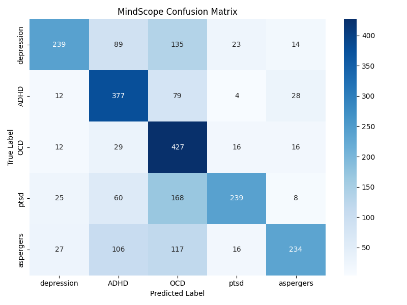
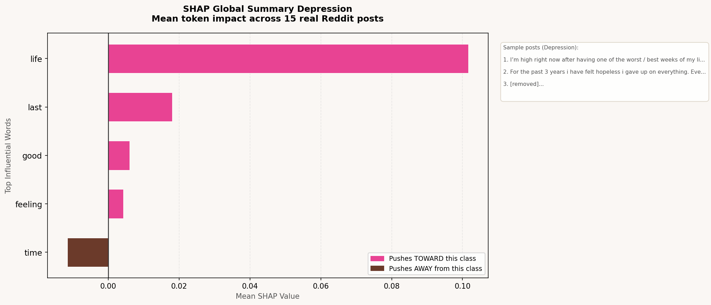
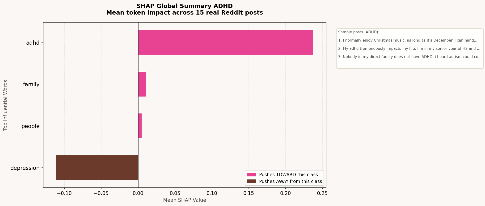
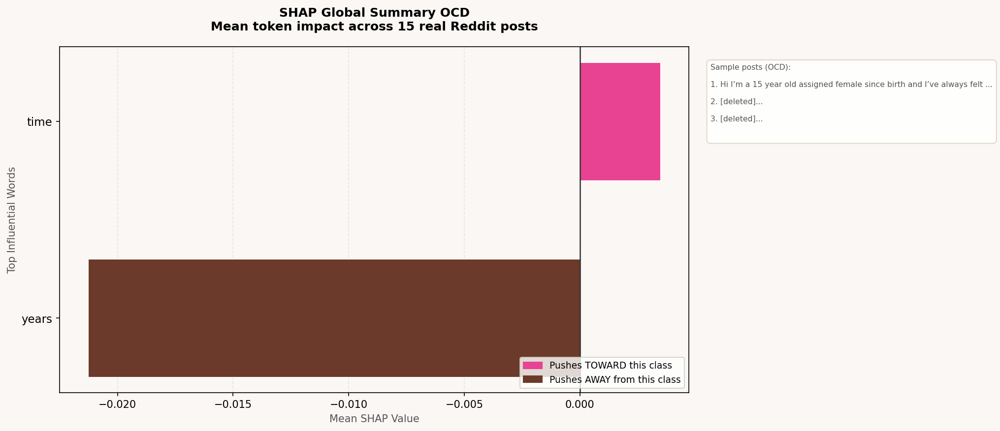
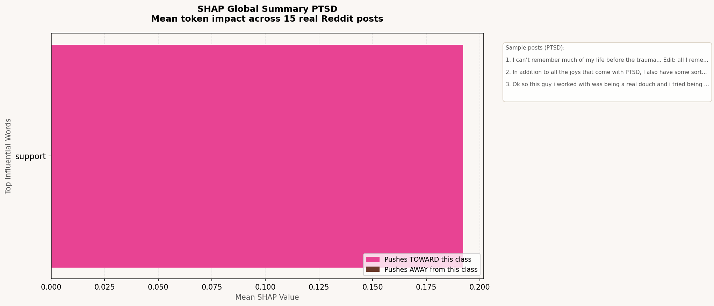
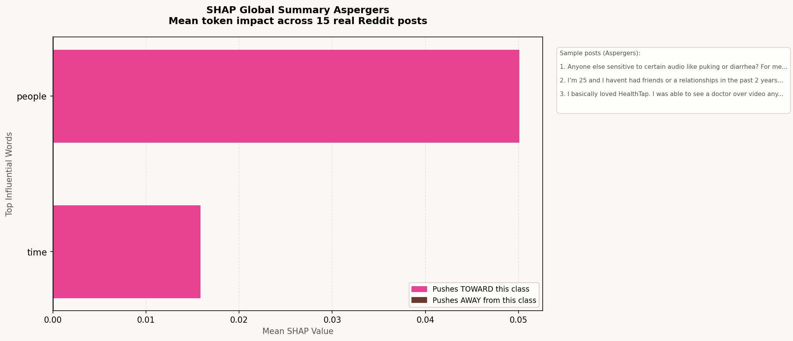
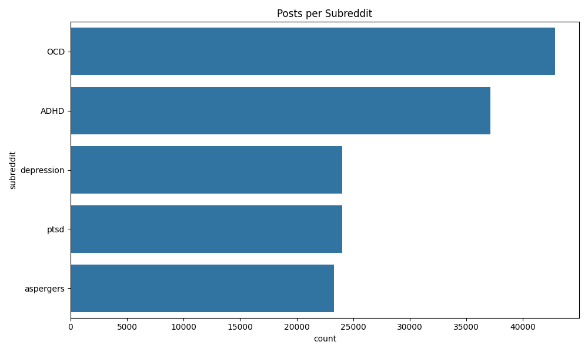

## Mental Health Signal Detection using Fine-tuned RoBERTa & Llama 3

> *"Have you been talking to ChatGPT when you're low and feeling exhausted because it asks too many questions? For a change, meet MindScope."*

[](https://huggingface.co/spaces/anumsagheer/mindscope)
[](https://huggingface.co/anumsagheer/mindscope-model)
[](https://pytorch.org)

**Try it live: https://huggingface.co/spaces/anumsagheer/mindscope**

### Why does this exist?

Most AI tools respond to mental health topics with generic, clinical language, or worse, they ask a a lot of follow-up questions before saying anything useful. MindScope was built as a research demonstration of something different: what if an AI was trained on the actual words real people use when they are struggling?

This tool was trained on 150,000 real Reddit posts from five mental health communities, not textbook definitions, not clinical notes, but the raw honest language of people navigating depression, ADHD, OCD, PTSD, and Aspergers every single day. The goal was to see if a machine learning model could learn to distinguish these five conditions purely from language patterns, and it can.

This is a research and portfolio project, not a clinical tool. It is a window into how modern NLP understands human emotion through language.


### What it does

1. You type anything, a random thought
2. MindScope's fine-tuned RoBERTa model reads it and identifies which mental health language pattern it most resembles across 5 categories
3. If the model is confident enough (above 60% confidence), Llama 3 generates a warm human one-liner response
4. If the model is not confident enough, like if you just type "heyy", it honestly tells you no strong signal was detected instead of guessing wrong


### Model Results

#### The Numbers

The model was trained on 100,000 Reddit posts (20,000 per class, balanced equally across all 5 categories) and evaluated on a test set of 10,000 posts it had never seen before.

| Category   | Precision | Recall | F1 Score |
|------------|-----------|--------|----------|
| Depression | 0.79      | 0.47   | 0.59     |
| ADHD       | 0.60      | 0.79   | 0.68     |
| OCD        | 0.47      | 0.89   | 0.61     |
| PTSD       | 0.84      | 0.47   | 0.60     |
| Aspergers  | 0.82      | 0.51   | 0.63     |
| **Overall**| **0.70**  | **0.63**| **0.62**|

**Overall accuracy: 63%**

#### Is 63% good?

I guess, yes, in context. This is a 5-class classification problem, meaning random guessing would give you 20% accuracy. At 63%, the model is 3.15x better than random chance. For a task where even humans might struggle to distinguish PTSD language from depression language without full context, this is a meaningful result. This is a meaningful result, which is still improving by the day (actually every two weeks).

A few things worth noting from the results:

- **OCD had the highest recall (0.89)**- the model catches 89% of real OCD posts. OCD language is distinctive: checking behaviors, specific rituals, intrusive thought patterns. The model learned this well.
- **ADHD F1 of 0.68 is the strongest overall** scattered focus language like "started four things, finished none" is recognizable.
- **Depression and OCD got confused with each other**- this is actually clinically accurate, not a model failure. Both conditions involve rumination and negative self-talk, so the linguistic overlap is real.
- **PTSD was the hardest**- PTSD language overlaps with both depression (hopelessness) and OCD (hypervigilance), making it genuinely difficult to distinguish from text alone.

#### Confusion Matrix



Rows = what the post actually was. Columns = what the model predicted. Dark squares on the diagonal = correct predictions. The bright OCD diagonal and strong ADHD diagonal are the standout results.


### SHAP Explainability

One of the biggest criticisms of ML models is that some of them are black boxes, they give you an answer but you have no idea why. To address this, MindScope includes SHAP (SHapley Additive exPlanations) analysis.

SHAP assigns each word in a text a responsibility score, how much did this specific word push the model toward or away from a particular prediction? Pink bars mean the word pushed the model toward that class. Brown bars mean it pushed away.

Each plot below was generated by running 15 real Reddit posts through the SHAP analyzer and averaging the word impact scores across all 15 posts, giving a global picture of which words matter most per category.

#### Depression


#### ADHD


#### OCD


#### PTSD


#### Aspergers


#### A note on SHAP and model accuracy

SHAP works best when the underlying model is highly confident and accurate. At 63% accuracy, the SHAP values are real and correct, but they can look noisy. Words like "time" appearing for OCD (people spend a lot of time on rituals) or "years" for PTSD (years of carrying trauma) are genuinely meaningful signals the model picked up on. With a higher accuracy model trained on even more data, the patterns would be even cleaner. This is a limitation worth naming, and along the lines of thoughtful ML work than just running a notebook.


#### Tech Stack

| Tool | Purpose |
|------|---------|
| PyTorch | Training loop, tensors, model operations |
| HuggingFace Transformers | RoBERTa-base model and tokenizer |
| RoBERTa-base (125M params) | Pretrained language model, fine-tuned for classification |
| HuggingFace Datasets | Loading 150K Reddit posts |
| Groq API + Llama 3.3-70B | Generating warm human responses |
| SHAP | Model explainability |
| Gradio | Web UI |
| HuggingFace Spaces | Free permanent deployment |
| scikit-learn | F1 score, confusion matrix, train/test split |
| pandas | Data loading, sampling, preprocessing |
| matplotlib, seaborn | Visualizations |


### Project Structure

```
mindscope/
├── 01_explore_data.py        # Dataset exploration and class distribution
├── 02_prepare_data.py        # Sampling, labeling, train/val/test split
├── 03_tokenize_and_train.py  # RoBERTa fine-tuning with PyTorch
├── 04_evaluate.py            # F1 score, confusion matrix evaluation
├── 06_shap_explain.py        # SHAP global summary plots
├── app.py                    # Gradio UI, Groq integration
├── requirements.txt          # Dependencies
├── class_distribution.png    # Dataset class balance visualization
├── confusion_matrix.png      # Model evaluation heatmap
├── shap_depression.png       # SHAP - Depression
├── shap_adhd.png             # SHAP - ADHD
├── shap_ocd.png              # SHAP - OCD
├── shap_ptsd.png             # SHAP - PTSD
├── shap_aspergers.png        # SHAP - Aspergers
└── README.md
```


### How it was built

#### The data
Downloaded the Reddit Mental Health Dataset from HuggingFace, 150K posts across 5 subreddits: r/depression, r/ADHD, r/OCD, r/ptsd, r/aspergers. Sampled 20,000 posts per class for balanced training. Split 80/10/10 into train/validation/test.

#### Why equal sampling matters
OCD had 42,000 posts while Aspergers had 22,000. If we trained on raw counts, the model would learn to just predict OCD most of the time because it saw it most. Equal sampling at 20,000 per class forces the model to genuinely learn the differences between all 5 categories.

#### Fine-tuning RoBERTa
RoBERTa already understands English deeply from pretraining on billions of web pages. Fine-tuning means taking that existing knowledge and specifically teaching it mental health language patterns. Trained for 3 epochs using AdamW optimizer with learning rate 2e-5.

#### The two-model pipeline
```
User Input Text
      |
      v
RoBERTa Classifier --> Confidence Score and Top Label
      |
      |-- Below 60% confidence --> "No strong signal detected"
      |
      +-- Above 60% confidence
              |
              v
         Groq (Llama 3) --> Warm one-liner response
              |
              v
         Gradio UI displays both
```


### Dataset Distribution



OCD had nearly double the posts of other classes, which is exactly why equal sampling was critical before training.


## Disclaimer

This tool is built for research and educational purposes only. It is not a clinical diagnostic tool, not a replacement for professional mental health support, and definitely not your friend. The model makes mistakes, 37% of the time, to be precise. If you are struggling, please reach out to a mental health professional.

